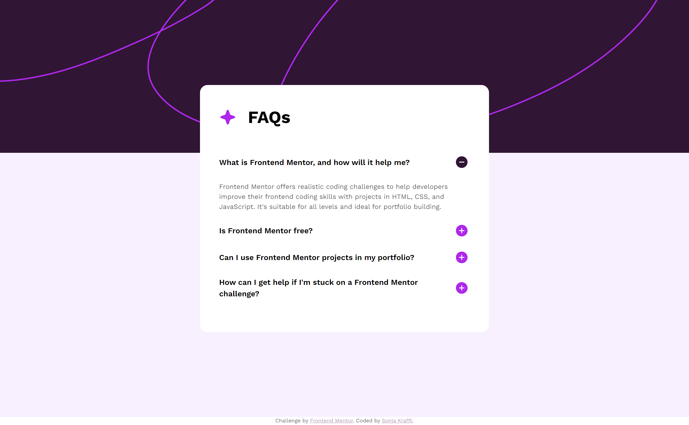
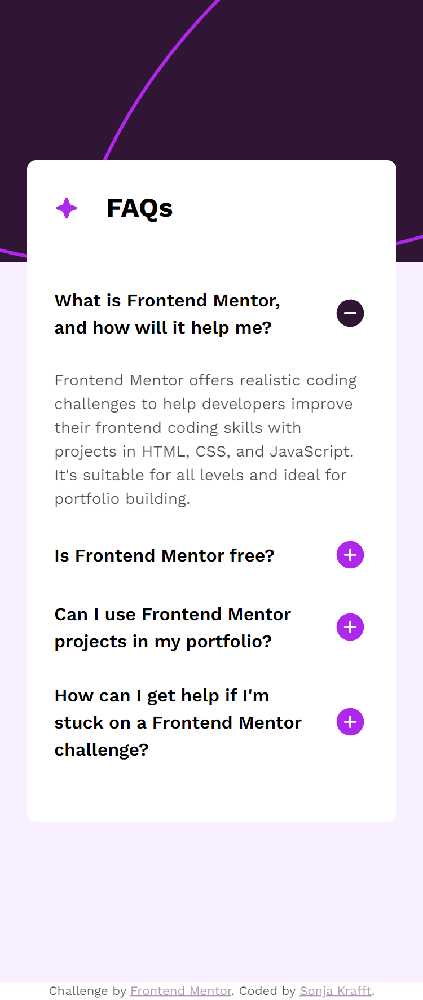

# Frontend Mentor - FAQ accordion solution

This is a solution to the [FAQ accordion challenge on Frontend Mentor](https://www.frontendmentor.io/challenges/faq-accordion-wyfFdeBwBz). Frontend Mentor challenges help you improve your coding skills by building realistic projects. 

## Table of contents

- [Overview](#overview)
  - [The challenge](#the-challenge)
  - [Screenshot](#screenshot)
  - [Links](#links)
- [My process](#my-process)
  - [Built with](#built-with)
  - [What I learned](#what-i-learned)
- [Author](#author)

## Overview

### The challenge

Users should be able to:

- Hide/Show the answer to a question when the question is clicked
- Navigate the questions and hide/show answers using keyboard navigation alone
- View the optimal layout for the interface depending on their device's screen size
- See hover and focus states for all interactive elements on the page

### Screenshot




### Links

- Live Site URL: [Add live site URL here](https://your-live-site-url.com)

## My process

### Built with

- HTML, SCSS, JS
- Mobile-first workflow
- Webstorm with Simple Hot Reload Server (install: `npm install -g simple-hot-reload-server`, start: `hrs`) and File Watcher with SCSS for building CSS

### What I learned


- EventListener for all buttons
```js
const buttonList = document.querySelectorAll(".toggle_button");

buttonList.forEach((item) => {
  item.addEventListener('click', handleToggle);
});
```
- Toggle feature to add or remove attribute of class list
```js
answer.classList.toggle("hide");
```

## Author

- Github - [Sonja Krafft](https://www.github.com/sonmikrafft)
- Frontend Mentor - [@sonmikrafft](https://www.frontendmentor.io/profile/sonmikrafft)